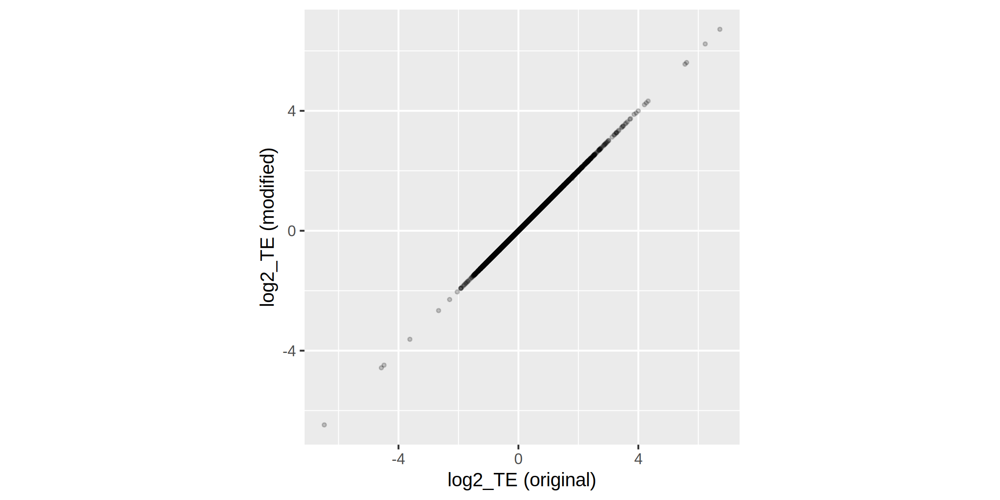

This is a copy of [scikit-ribo](https://github.com/schatzlab/scikit-ribo) by Fang et al with some modifications to run on fly genome:

- The scikit-ribo is design for analysis of yeast data, which does not have UTR annotation. In order to run with other genomes, the boundaries of exons in gtf should be confined to CDS regions (including stop codons). This can be generated by merging CDS and stop codons intervals of same transcript (GRangeList in R) with `GenomicRanges::reduce`.
- For each gene, I only used the CDS annotation of the major isoform (most abundant one in kallisto results). The tpm of all isoforms of the same gene were aggregated and used for build.
- To run `call_rnafold.py`, the expanded CDS fasta can be first created with `scikit-ribo-build`. Break the execution when the `prefix.expand.CDS.fa` was created. And then run `call_rnafold.py`. It is very slow for long CDSs so that I excluded CDSs longer than 10k nt (will remove dozens of genes).
-  the fasta header line generated with `bedtools getfasta` is different depend on the exact version. The `faiter` in `gtf_preprocess.py` should be modified correspondingly.
- Although sorted bam ared used as input for `scikit-ribo-run.py`, chromosomes in bam are usually sorted based on their appearance in the referene fasta rather alphabetically. This will trigger errors when executing `bam_process.py`. The error is fixed by adding an additional step of sorting.
- The build step takes huge memory. I have several samples and have to run the build step one by one. The build step will crash if I run several build steps simoutaneously.

I firsted ran with the original scripts on yeast data (Weinberg 2016) and got almost the same results as shown in scikit-ribo paper. Changes mentioned above are used to make sure the input files are parsed properly and do not affect any computational step. The modified scripts generated the same results as the original version.

- Error message related to `site-packages/glmnet_py/cvglmnet.py`:
Change line 260 `scipy.floor(nobs/nfolds)` to `int(scipy.floor(nobs/nfolds))`.

There are also one or two other errors that are difficult to reproduce and debug (Usually fixed by rerun the build step or run step).

See below for the original README of scikit-ribo.

------------------------------------------------------------------------------

## *scikit-ribo* 

#### - Accurate inference and robust modelling of translation dynamics at codon resolution with Riboseq data
#### https://github.com/hanfang/scikit-ribo

--------
## Documentation
Read the Docs:  or click [me](http://scikit-ribo.readthedocs.io/en/latest/)

## Contact

#### Han Fang
#### Stony Brook University & Cold Spring Harbor Laboratory
#### Email: hanfang.cshl@gmail.com

## Requirement: 
#### Environment: Python3, Linux

Recommend setting up your environment with [Conda](https://conda.io/docs/intro.html)

#### Dependencies:

| Dependencies | Version >= |
| ------------- |:-------------:|
| bedtools | 2.26.0 |

When using `pip install scikit-ribo`, all the following dependencies will be pulled and installed automatically.

| Python package| Version >= |
| ------------- |:-------------:|
| colorama | 0.3.7 |
| glmnet-py | 0.1.0b |
| gffutils | 0.8.7.1 |
| matplotlib | 1.5.1 |
| numpy | 1.11.2 |
| pandas | 0.19.2 |
| pybedtools | 0.7.8 | 
| pyfiglet | 0.7.5 | 
| pysam | 0.9.1.4 |
| scikit-learn | 0.18 |
| scipy | 0.18.1 |
| seaborn | 0.7.0 |
| termcolor | 1.1.0 |

## Install

To install `scikit-ribo`, simply use the below command
    
    pip install scikit-ribo

## Usage

See the documentation on Read the Docs:  or click [me](http://scikit-ribo.readthedocs.io/en/latest/)

For more information, please refer to the [template shell script](https://github.com/hanfang/scikit-ribo/blob/master/test/run_scikit_ribo.sh) about details of executing the two modules.

## Introduction

Scikit-ribo has two major modules: Ribosome A-site location prediction, and translation efficiency (TE) inference using a penalized generalized linear model (GLM). 

A complete analysis with scikit-ribo has two major procedures: 
1) data pre-processing to prepare the ORFs, codons for a genome: `scikit-ribo-build.py`
2) the actual model training and fitting: `scikit-ribo-run.py`

Inputs:
1) The alignment of Riboseq reads (bam)
2) Gene-level quantification of RNA-seq reads (from either Salmon or Kallisto)
3) A gene annotation file (gtf)
4) A reference genome for the model organism of interest (fasta)

Outpus:
1) Translation efficiency estimates for the genes
2) Translation elongation rate for 61 sense codons
3) Ribosome profile plots for each gene
4) Diagnostic plots of the models

## Reference

Fang et al, "Scikit-ribo: Accurate inference and robust modelling of translation dynamics at codon resolution" (Preprint coming up)
